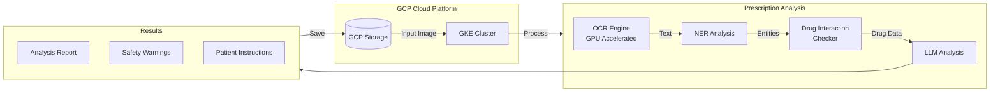

# Prescription Analysis System


A cloud-native system for analyzing medical prescriptions using OCR, NER, and drug interaction checking. The system processes handwritten prescriptions and provides detailed analysis with safety warnings.

## System Architecture



## Features

- **OCR Processing**: GPU-accelerated text extraction from prescription images
- **Named Entity Recognition**: Identifies medications, dosages, and instructions
- **Drug Interaction Analysis**: Checks for potential drug interactions using OpenFDA
- **Cloud Storage Integration**: Works with GCP Storage for scalable processing
- **Kubernetes Deployment**: Ready for containerized deployment on GKE

## Prerequisites

- Python 3.8+
- Docker
- Google Cloud SDK
- Kubernetes CLI (kubectl)
- OpenFDA API key

## Quick Start

1. **Clone and Setup**:
```bash
git clone https://github.com/yourusername/prescription-analyzer
cd prescription-analyzer
make setup
```

2. **Configure Environment**:
```bash
# Create .env file
echo "OPENFDA_API_KEY=your_key_here" > .env
echo "GOOGLE_PROJECT_ID=your_project_id" >> .env
```

3. **Run Locally**:
```bash
make run
```

4. **Deploy to GCP**:
```bash
# Build and push Docker image
make docker-build
make docker-push

# Deploy to GKE
make deploy
```

## Project Structure

```
├── src/
│   ├── ocr_processor.py      # OCR processing
│   ├── medication_ner.py     # Named entity recognition
│   ├── drug_interaction.py   # Drug interaction checking
│   └── prompt_llm.py        # LLM integration
├── kubernetes/              # Kubernetes configurations
├── scripts/                # Installation scripts
└── Makefile               # Build automation
```

## API Usage

Process a prescription:
```python
from src.main import process_prescription

results = process_prescription("path/to/image.jpg")
print(results['medications'])
print(results['warnings'])
```

## Deployment

Deploy to GKE:
```bash
# Setup GKE cluster
gcloud container clusters create prescription-cluster \
    --region us-central1 \
    --num-nodes 3 \
    --machine-type n1-standard-4

# Deploy application
kubectl apply -f kubernetes/
```

## Future Improvements

- [ ] Add support for multiple languages
- [ ] Implement real-time processing
- [ ] Add patient history integration
- [ ] Enhance drug interaction detection
- [ ] Add support for Azure and AWS

### Email : asadali047@gmail.com